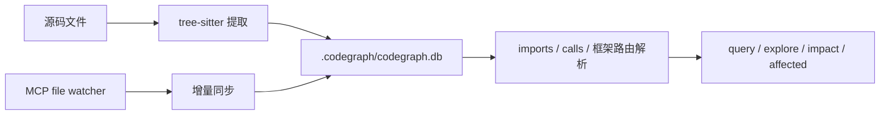

# COREONE CodeGraph 使用指导

本项目使用 `@colbymchenry/codegraph`（v1.3.0）作为本地代码知识图谱工具。它用 tree-sitter 解析源码，生成 SQLite 图谱索引（`.codegraph/codegraph.db`），通过 CLI 和 MCP 给开发者与 AI 代理提供结构化代码上下文——先查图谱再动手，比 grep/逐文件 Read 少很多来回。

> 平台说明：命令按 macOS / Linux（bash / zsh）给出。本项目主要在 macOS 上开发。Windows 用 PowerShell 时命令本身一致，仅安装脚本不同（见下）。

## 工作原理



核心点：

- `.codegraph/codegraph.db` 是机器可查询的真实知识图谱，**每台机器本地生成、不提交 Git**。
- 仓库里**提交的**只有：本指导、人读快照 `COREONE-CodeGraph-knowledge-graph.md`、索引范围配置 `codegraph.json`、Claude Code 的 MCP 注册 `.mcp.json`。
- 配好 MCP 后，`codegraph serve --mcp` 会监听源码改动自动增量同步，图谱不会过时。
- 没有 watcher 的环境里用 `codegraph sync` 手动同步。

## 一次性设置（每台开发机 / 每个代理工作区）

### 1. 安装 CLI

```bash
# macOS / Linux —— 官方脚本（自带运行时，无需 Node）
curl -fsSL https://raw.githubusercontent.com/colbymchenry/codegraph/main/install.sh | sh

# 或者：已装 Node，直接 npm 全局装（本项目实测用的是这个）
npm i -g @colbymchenry/codegraph

# Windows PowerShell
# irm https://raw.githubusercontent.com/colbymchenry/codegraph/main/install.ps1 | iex
```

装完**开新终端**再继续（PATH 生效）。校验：

```bash
codegraph version   # 应输出 1.3.0（或更新）
```

### 2. 把 CodeGraph 接到 Claude Code（本项目主用代理）

在仓库根目录执行：

```bash
codegraph install --target claude --location local
```

这会写三个文件：

| 文件 | 作用 | 是否提交 Git |
|---|---|---|
| `.mcp.json` | 注册 `codegraph` MCP server（`codegraph serve --mcp`） | ✅ **已提交**（团队共享，克隆即得） |
| `.claude/settings.json` | 自动放行 `mcp__codegraph__*` 工具 + `UserPromptSubmit` 钩子（`codegraph prompt-hook`，注入图谱新鲜度提示） | ❌ **本地**（每台机器自己跑 install 生成；钩子依赖本机装了 CLI，故不入库、不强加给别的机器） |
| `.claude/CLAUDE.md` | 提示代理「有 `.codegraph/` 时优先用 CodeGraph」 | ❌ 本地（install 自动生成/清理，带 `CODEGRAPH_*` 标记） |

> ⚠️ **执行完要重启 Claude Code**，MCP server 和钩子才会加载（当前会话里不会凭空出现 `codegraph_*` 工具）。
> 其它代理（Codex / Cursor / Gemini 等）把 `--target` 换成对应 id：`codegraph install --target codex`。

### 3. 建本项目图谱

在仓库根目录执行：

```bash
codegraph init      # 创建 .codegraph/ 并完整索引，一步到位
codegraph status
```

正常状态应显示 `initialized: true`、`state: complete`、`pending changes: 0`，约 540 个文件。

之后**自动同步默认开启**：只要仓库有 `.codegraph/`，MCP watcher 会在你或代理增删改文件后 debounce 并增量写库，无需手动 re-run。

## 索引范围（`codegraph.json`，已提交）

CodeGraph 默认会跳过 `node_modules/`、`dist/` 等依赖/构建目录，并遵守 `.gitignore`。但本仓库根目录有若干**未被 gitignore 的本地非源码目录**（Syncthing 版本备份、工具缓存、全局 Claude 配置），不排除会把图谱撑到 4 万+ 节点、混入 python/rust/swift 噪声。故仓库根提交了 `codegraph.json` 显式排除：

```json
{
  "exclude": [
    ".claude-global/", ".tools/", ".stversions/",
    ".playwright-mcp/", ".codex/",
    ".claude/skills/", ".claude/skills-runtime/",
    "dist/", "**/dist/**"
  ]
}
```

改了这个文件后要 `codegraph index --force` 重建。真项目源码只有 `前端代码/`、`后端代码/`、`docs/`、`.github/`、少量根脚本。

## 常用命令

```bash
codegraph status                       # 图谱状态与统计
codegraph index --force                # 完整重建（改了 codegraph.json 后用）
codegraph sync                         # 手动增量同步
codegraph query requirePermission --limit 10   # 搜符号
codegraph explore "App.tsx AppLayout getAccessiblePaths"   # 一次性拿相关源码+调用路径+爆炸半径
codegraph node getDatabase             # 单符号：源码 + 调用方/被调用方轨迹
codegraph callers getDatabase          # 谁调用了它
codegraph callees initializeDatabase   # 它调用了谁
codegraph impact requirePermission --depth 3   # 改这个符号会波及什么
codegraph affected 后端代码/server/src/middleware/permissions.ts   # 改这些文件影响哪些测试
codegraph files --filter 后端代码/server/src/routes   # 看某目录下的文件结构
```

`codegraph explore` 就是 MCP 工具 `codegraph_explore` 的等价 CLI 输出——Claude Code 里有 MCP 时直接用工具，纯终端里用这条命令，结果一样。

## COREONE 推荐查询

| 场景 | 查询 |
|---|---|
| 系统入口 | `codegraph explore "App.tsx app.ts initializeDatabase"` |
| 前端权限和菜单 | `codegraph explore "AppLayout getAccessiblePaths NAV_PATH_MODULE"` |
| 后端 RBAC | `codegraph explore "requirePermission getEffectivePermissions SEED_MATRIX"` |
| 入库流程 | `codegraph explore "Inbound useInboundPage inbound-v1.1 genIdempotencyKey"` |
| 出库与 BOM 消耗 | `codegraph explore "Outbound outbound-v1.1 BOM outbound_abc_details"` |
| ABC 成本 | `codegraph explore "abc-v1.1 CostDashboard cost-runs cost-pools"` |
| LIS 与收入 | `codegraph explore "lis-cases case-revenue statement-import partner-pnl"` |
| 账实核对 | `codegraph explore "account-reconcile reconciliation supplement_orders"` |

## 开发流程建议

1. **改动前**：`codegraph explore "<模块/符号/问题>"` 找入口和爆炸半径；碰钱/口径改动再补一条 `codegraph impact <symbol>`。
2. 改代码。
3. 等 MCP watcher 自动同步，或手动 `codegraph sync`。
4. `codegraph status` 确认 `pending` 为 0。
5. `codegraph affected <files...>` 圈出受影响测试，缩小回归范围。
6. 跑对应 Vitest / Playwright 测试（黄金不变量 ¥13,152 / ¥27,870 的守护测试务必在内）。

## 注意事项

- **不要提交 `.codegraph/`**（`.gitignore` 已排除；它是每台机器的本地缓存）。
- Markdown 快照只是人读版、会过时；真正自动更新的是 `.codegraph/codegraph.db`，查最新结构以 `codegraph explore/status` 实时输出为准。
- 大于 1 MB 的文件（打包产物、压缩 JS）默认跳过。
- 若 CodeGraph 响应出现 staleness/新鲜度提示，按提示直接读取刚改的文件。
- 关闭匿名遥测：`codegraph telemetry off` 或设 `CODEGRAPH_TELEMETRY=0`。
- 卸载：`codegraph uninstall`（清各代理的 MCP 配置）、`codegraph uninit`（删本项目 `.codegraph/`）。
