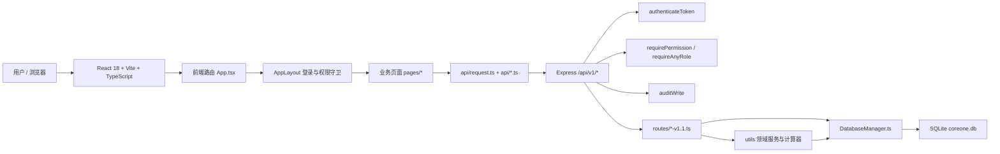
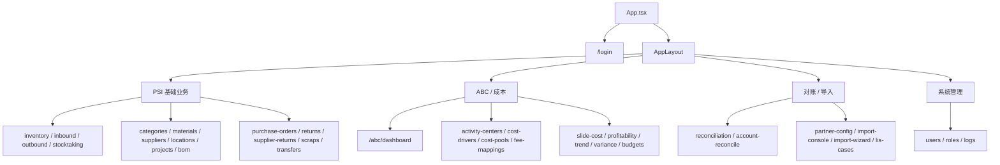
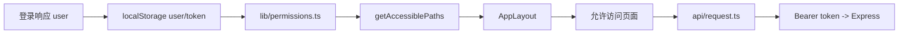

# COREONE CodeGraph 知识图谱

生成日期：2026-07-07（基于当前 master 真实索引重建；取代 2026-07-08 codex 那版基于旧 master 的快照）
工具：`@colbymchenry/codegraph` v1.3.0
目标：为 COREONE 建立可自动更新的本地代码知识图谱，并保留一份面向团队阅读的结构快照。

> ⚠️ **这份 Markdown 只是人读快照，会随代码演进过时。** 真正自动更新、可查询的图谱是本地 SQLite 索引 `.codegraph/codegraph.db`（不提交 Git）。查最新结构永远以 `codegraph explore/status` 的实时输出为准，别以本文档的数字为准。

## 机器图谱

CodeGraph 的正式图谱是仓库根目录下的本地 SQLite 索引：

```text
.codegraph/codegraph.db
```

该目录不提交到 Git（`.gitignore` 已排除）。每个开发者或代理工作区运行一次 `codegraph init` 后本地生成，之后由 MCP watcher 或 `codegraph sync` 自动增量更新。

**当前索引快照**（本机 `codegraph status`，已通过 `codegraph.json` 排除本地非源码目录 `.claude-global/`、`.tools/`、`.stversions/`、`.playwright-mcp/`）：

| 指标 | 值 |
|---|---:|
| indexed files | 541 |
| nodes | 5,990 |
| edges | 24,920 |
| db size | 28.1 MB |
| backend | node-sqlite |
| journal mode | wal |
| pending changes | 0 |
| languages | typescript(290) · tsx(220) · javascript(25) · yaml(4) · python(2) |

节点类型：

| kind | count |
|---|---:|
| import | 1,899 |
| function | 1,514 |
| constant | 731 |
| file | 537 |
| route | 445 |
| interface | 438 |
| variable | 213 |
| type_alias | 127 |
| property | 65 |
| method | 18 |
| class | 3 |

边类型：

| kind | count |
|---|---:|
| calls | 15,389 |
| contains | 5,008 |
| imports | 2,656 |
| references | 1,863 |
| instantiates | 4 |

## 系统图谱总览



## 关键节点（高入边基础设施 / 承重墙）

以下节点被最多其它代码依赖（按图谱真实入边排序，剔除测试框架与 HTTP 动词噪声），是改动时优先跑测试的对象：

| 节点 | 位置 | 作用 | 入边量级 |
|---|---|---|---:|
| `getDatabase` | `后端代码/server/src/database/DatabaseManager.ts` | 后端持久化访问入口，几乎所有路由/工具/测试都经它 | ~617 |
| `error` / `success` | `后端代码/server/src/utils/response.ts` | 统一响应包装，全站路由复用 | ~755 / ~480 |
| `request` | `前端代码/src/api/request.ts` | axios 客户端、JWT 注入、refresh token、响应解包 | 高 |
| `genIdempotencyKey` | `前端代码/src/api/request.ts` | 入/出库等写操作幂等键生成 | ~206 |
| `requirePermission` | `后端代码/server/src/middleware/permissions.ts:87` | 数据驱动 RBAC 模块级 R/W 权限守卫（36 处挂载） | — |
| `SEED_MATRIX` | `后端代码/server/src/middleware/rbac-matrix.ts:29` | 31 个权限模块 × 非 admin 角色的初始矩阵 | — |
| `getEffectivePermissions` | `后端代码/server/src/middleware/permissions.ts:54` | 角色 → 有效权限解析 | — |
| `initializeDatabase` | `后端代码/server/src/database/DatabaseManager.ts` | SQLite schema、兼容迁移、seed 核心入口 | — |
| `App` | `前端代码/src/App.tsx` | 前端页面路由入口（54 条路由声明） | — |
| `AppLayout` | `前端代码/src/components/layout/AppLayout.tsx` | 校验 token、角色和可访问路径 | — |
| `app` | `后端代码/server/src/app.ts` | Express 入口，挂载中间件、审计与全部 API 路由 | — |

## 前端图谱



权限链路：



## 后端 API 图谱

```mermaid
flowchart TD
  AppTS["server/src/app.ts"] --> Public["/api/v1/auth"]
  AppTS --> MasterData["基础资料 API"]
  AppTS --> InventoryFlow["库存流转 API"]
  AppTS --> CostEngine["ABC / 成本 API"]
  AppTS --> RevenueRecon["收入 / 对账 API"]
  AppTS --> RBACLogs["用户 / 角色 / 日志 API"]

  MasterData --> Categories["categories"]
  MasterData --> Materials["materials"]
  MasterData --> Suppliers["suppliers"]
  MasterData --> Locations["locations"]
  MasterData --> Projects["projects + project-catalog"]
  MasterData --> BOM["boms"]

  InventoryFlow --> Inventory["inventory"]
  InventoryFlow --> Inbound["inbound"]
  InventoryFlow --> Outbound["outbound"]
  InventoryFlow --> Stocktaking["stocktaking"]
  InventoryFlow --> Returns["returns / supplier-returns"]
  InventoryFlow --> Transfers["transfers / scraps"]
  InventoryFlow --> PO["purchase-orders"]

  CostEngine --> ABC["abc"]
  CostEngine --> Equipment["equipment / equipment-types"]
  CostEngine --> Labor["labor-times"]
  CostEngine --> Indirect["indirect-costs"]
  CostEngine --> Antibody["antibody-cost"]
  CostEngine --> Adjust["cost-adjustments"]

  RevenueRecon --> Reconciliation["reconciliation"]
  RevenueRecon --> AccountRecon["account-reconcile"]
  RevenueRecon --> LIS["lis-cases"]
  RevenueRecon --> Revenue["case-revenue"]
  RevenueRecon --> PnL["partner-pnl / hospital-pnl / ngs"]
  RevenueRecon --> Import["partner-config / statement-import"]
```



API 装配规则：

| 层 | 机制 |
|---|---|
| 公开接口 | `/api/v1/auth` |
| 登录校验 | 多数业务路由由 `authenticateToken` 保护 |
| 模块读权限 | `app.ts` 挂载层用 `requirePermission(module, 'R')` |
| 写权限 | 路由内部用 `requirePermission(module, 'W')` 或 `requireAnyRole` |
| 审计 | `auditWrite` 对登录后成功写操作留痕（`operation_logs`） |
| 错误处理 | `errorHandler` + 统一 JSON 404 |

复杂度最高的路由模块（图谱内 `route` 节点计数，实时以 `codegraph explore` 为准）：

| route file | route 节点数 |
|---|---:|
| `abc-v1.1.ts` | 55 |
| `app.ts`（挂载层） | 40 |
| `antibody-cost-v1.1.ts` | 14 |
| `account-reconcile-v1.1.ts` | 12 |
| `reconciliation-v1.1.ts` | 11 |
| `equipment-v1.1.ts` | 9 |
| `materials.ts` | 8 |
| `indirect-cost-v1.1.ts` | 8 |

> 前端 `App.tsx` 也有 54 个 `route` 节点（React Router 声明），不是后端接口，别混。

## 数据域图谱

```mermaid
flowchart TD
  DB["SQLite coreone.db"] --> Master["主数据"]
  DB --> Inventory["库存流水"]
  DB --> Purchase["采购 / 退供"]
  DB --> ProjectBom["项目 / BOM"]
  DB --> RBAC["用户 / RBAC / 日志"]
  DB --> ABC["ABC 成本核算"]
  DB --> Revenue["LIS / 收入 / 院级 P&L"]
  DB --> Reconcile["账实核对 / 补款"]

  Master --> M1["material_categories / materials / suppliers / partners / locations"]
  Inventory --> I1["inventory / batches / inbound_records / outbound_records / outbound_items / stock_logs"]
  Inventory --> I2["stocktaking_records / return_records / scrap_records / batch_depletion"]
  Purchase --> P1["purchase_orders / supplier_returns"]
  ProjectBom --> B1["projects / boms / bom_items / bom_versions"]
  RBAC --> R1["users / roles / user_roles / app_settings / operation_logs"]
  ABC --> A1["equipment / labor / indirect_cost / activity_centers / cost_drivers / cost_pools"]
  ABC --> A2["outbound_abc_details / cost_runs / abc_periods / budgets / quality_costs / audit_logs"]
  Revenue --> V1["lis_cases / case_revenue / case_revenue_lines / ngs_products / ngs_orders"]
  Revenue --> V2["partner_configs / partner_config_changes / charge_codes"]
  Reconcile --> C1["reconcile_hospital_months / reconcile_diffs / supplement_orders / reconcile_case_hints"]
```



## 推荐查询（symbol 均已在本仓库核实存在）

```bash
codegraph status
codegraph explore "App.tsx app.ts initializeDatabase"
codegraph explore "AppLayout getAccessiblePaths NAV_PATH_MODULE"
codegraph explore "requirePermission getEffectivePermissions SEED_MATRIX"
codegraph explore "Inbound useInboundPage inbound-v1.1 genIdempotencyKey"
codegraph explore "abc-v1.1 CostDashboard cost-runs cost-pools"
codegraph explore "lis-cases case-revenue statement-import partner-pnl"
codegraph explore "account-reconcile reconciliation supplement_orders"
codegraph impact requirePermission --depth 3
codegraph callers getDatabase
codegraph affected 后端代码/server/src/middleware/permissions.ts
```

## 维护判断

1. `getDatabase`、`response.ts` 的 `success/error`、`request.ts`、`requirePermission` 是高入边基础设施节点，改动时优先跑后端权限/API 测试与前端 e2e（`codegraph affected <files...>` 可自动圈出受影响测试）。
2. `abc-v1.1.ts`（55 route 节点）是当前最大后端路由模块，后续若继续增长应考虑拆 service 或子路由。
3. 新增页面必须同步四处：`前端代码/src/App.tsx`、`前端代码/src/lib/permissions.ts`、后端 `app.ts` 挂载权限、`middleware/rbac-matrix.ts` 的 `SEED_MATRIX`——`codegraph explore` 一次即可看全这条链。
4. 碰钱/口径改动（成本、对账、收入）前，先 `codegraph impact <symbol>` 看爆炸半径，再定测试范围；黄金不变量 ¥13,152 / ¥27,870 的守护测试务必包含在内。
