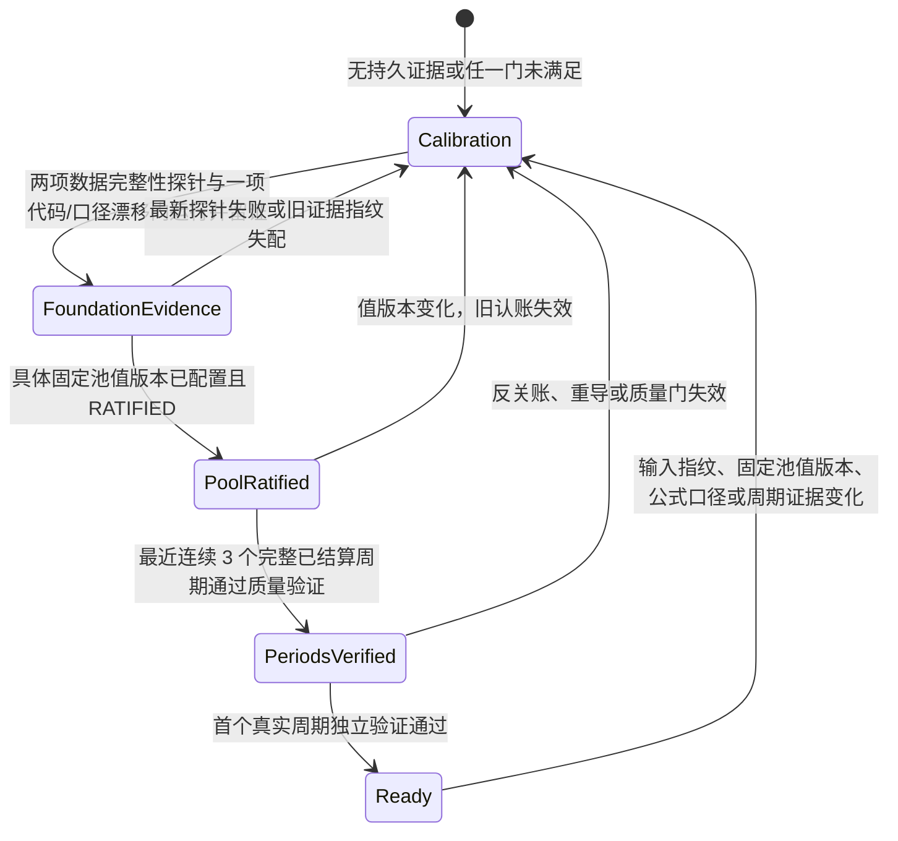

# 院级贡献毛利真实解锁闭环｜PM 决策与交付基线

> 本文保存稳定的业务现状、验收定义与分阶段方案；实时 base SHA、开放 PR、checks 和最终测试数量只放对应 PR body / GitHub，交付前必须现场刷新。任何先合并且会改变库存事实链写入保护的上游增量，都要求 A 吸收最新 master 后重跑库存探针与全回归。
> 本文只覆盖原规划第 4 项，不处理安全 #119、契约 #121/#122、分支保护治理、通用数值/权限遗留或 Issue 批量创建。

## 一页业务基线

### 业务结论

这条产品链路必须长期满足“门锁得住、真实钥匙才开门”。以下是 2026-07-12 以 `origin/master@c06166331f37` 捕获的产品基线，不作为实时仓库状态；实时 base SHA、开放 PR 和验证结果只在对应 PR body / GitHub 刷新：

- 用户能进入 `/hospital-cm`，看到整盘校准视图、医院人工对照、就绪清单和口径水印。
- 未就绪时 `/full-health` 返回 403；完整数值不泄漏，完整组件不进 DOM，URL 参数不能强开。
- 默认按绝对贡献展示，不按“最差”排序；系统不自动点名、砍院或生成谈价清单。
- 基线的四个就绪输入仍是占位探针，因此完整体检态不可达。
- 空数据会被现有页面显示为 `¥0` / `0%`，历史失真仍只是脚注，纯代送/会诊院也没有可靠的账户全集与金额分母。这三点会把“不知道”误读成“没有”。

A 的验收边界是把地基红灯接上真实传感器并留下不可改写的检查证据，不负责把门打开；固定成本池、三个真实周期和首周期独立验证必须在后续阶段接上真实来源。

### 缺口、责任和最早验收

| 缺口 | 性质 | 责任角色 / 具名指派状态 | 依赖 | 最大风险 | 最早可验收节点 |
|---|---|---|---|---|---|
| 数据地基证据 | 部分已接线 | 技术/数据负责人，具名人待 PM 指定 | A 控制面；真实三件套盘点 | 跨月复用、孤儿或空基线会阻断 | 2026-09-30 |
| 固定成本池具体值与认账 | 真实业务数据缺失 | 财务业务负责人，签字人待 PM 指定 | B；月度金额依据 | 无值、无版本、无对具体值签字 | 2026-08-31 |
| 最近三个有效周期 | 数据与验证结构都缺 | PM 推进人 + 数据 owner | A、B、C；医院范围快照与三件套 | “已关账”不等于完整；可能没有三个可回溯周期 | 条件成立时 2026-10-31 |
| 首个真实周期独立验证 | 真实证据缺失 | 技术/数据 owner 负责制备；独立 reviewer 负责签署，均待指定 | C；脱敏 source manifest、手核与成本 golden | 测试 fixture 被误当真实证据 | 条件成立时 2026-10-31 |
| 历史失真月 | 真实信号尚未落库 | 财务月结 + LIS 数据 owner，具名人待指定 | C/D；逐月成本基线与来源哈希 | 旧月被当前成本参数静默重述 | 2026-09-30 完成来源盘点/规则 checkpoint；D 真实样本验收依赖 C，最早 2026-10-31 |
| 纯代送/会诊 UNMEASURED | 部分是未接线，部分是真缺数 | 财务数据 owner + 业务 owner | D；月度账户全集、无病例号收入、外购/专家/物流成本 | 未知金额被渲染为 0，或院完全不入表 | 2026-10-31 可先验“诚实不可测”；盈利可测日期待数据承诺 |
| 前端解锁闭环 | 尚未接线 | 前端 owner + PM 验收 | A-D、mockup 拍板 | ready 后仍同时显示影子文案 | E，依赖前四阶段 |

## 机器状态与状态机

### 数据来源

| 条件 | 目标真实来源 | A 的机器判定 | 自动失效条件 |
|---|---|---|---|
| 库存守恒 | `inventory` 与有效 `batches.remaining` 的批量聚合探针 | 空基线、负库存、孤儿或守恒漂移一律失败 | `materials/inventory/batches` 任一增删改、schema 或探针版本变化 |
| 期间键 | 已拍板的 `(partner_id, case_no)` 身份 + `case_revenue.service_month`；跨月复用即禁出 | 空基线、空月份、跨月复用或三件套孤儿一律失败 | 三件套增删改、schema 或探针版本变化 |
| 常量冻结 | 受代码审查与 drift-guard 保护的 CM 常量 manifest 与规范正反例公式行为制品签名 | 代码/口径签名不一致一律失败；院级 CM 公式版本为 `2026-07-12.a` | 任一关键常量、门集、拆分公式、计算/上卷行为或院级 CM 公式版本变化 |
| 固定成本池 | A 中明确 `not_connected` | 未满足 | B 后：值版本变化使旧 RATIFIED 自动失效 |
| 三个周期 | A 中明确 `not_connected` | 0/3 | C 后：反关账、重导、范围/来源/公式指纹变化 |
| 首周期验证 | A 中明确 `not_connected` | 未满足 | C 后：独立证据撤销或绑定输入失效 |

数据库不保存 `ready` 字段。就绪只能按当前有效证据派生：

A 使用五张机器表：

- `hospital_cm_readiness_milestones`：当前责任角色、具名 owner/reviewer、due、预计日期、修订号与完成证据引用/hash；具名责任人缺失本身就让对应门 fail-closed。
- `hospital_cm_readiness_milestone_events`：每一版 owner、旧/新日期、原因、操作者、时间与完成证据的 append-only 快照；连续改期后也不会覆盖旧记录。
- `hospital_cm_readiness_probe_runs`：一次真实探针运行的版本、总结果、输入指纹、操作者和原因。
- `hospital_cm_readiness_probe_checks`：固定三门的聚合证据；不保存医院名、病例号或原始业务行。
- `hospital_cm_readiness_source_revisions`：库存、三件套及当前成本主数据每次增删改都单调递增；即使总量不变或值改后又改回，旧证据也会失效。

探针 run/check 与里程碑 event 都有数据库级 append-only 触发器，禁止 UPDATE / DELETE；一次 run 与三项 check 原子写入，任何 check 落证失败都会整批回滚。GET `/readiness` 只读，不会偷偷新增证据；只有 `cost_analysis:W` 可显式请求系统重跑，调用者不能提交 `ready/met/passed/checks`。

## 里程碑

当前 3 个目标日期、4 个就绪条件不自行改期，先按“有条件保留”处理：

| 条件 | 责任角色 / 具名指派状态 | due | 节点风险 | 完成证据 |
|---|---|---|---|---|
| 固定成本池已配置并对具体值版本认账 | 财务业务负责人；具名人待 PM 指定 | 2026-08-31 | 技术可实现，业务值/签字人未到 | B 的值版本 + RATIFIED 记录 |
| 数据地基门全绿 | 技术/数据负责人；具名人待 PM 指定 | 2026-09-30 | 有风险：真实三件套中的跨月复用/孤儿需先清理 | A 最新有效 probe run |
| 最近三个完整周期 | PM 推进人；具名人待 PM 指定 | 2026-10-31 | 取决于能否回溯三期 | C 的周期范围、三件套、质量与来源指纹 |
| 首个真实周期独立验证 | 技术/数据 owner + 独立 reviewer；二者均待指定 | 2026-10-31 | 取决于脱敏真实样本与成本 golden | source manifest + 独立手核 + reviewer + CI golden |

建议最迟 2026-07-31 完成具名责任人指派、候选周期与源数据盘点。未具名指派会以机器红灯阻断就绪。若没有最近连续三个可回溯合格周期，建议把整体节点调整为“第三个合格周期关账后 + 独立验收窗口”，而不是工程侧自行改日期。

机器告警规则：未完成且 `due < 服务器 Asia/Shanghai 业务日期` 即逾期；`due > previous_due` 或 `projected_date > previous_projected_date` 即后移告警。每次改动都写 append-only event，完成证据必须成对登记引用与 SHA-256；URL `asOf` 被拒绝，不能回填旧日期隐藏告警。

## 历史失真与 UNMEASURED 规则

### 历史失真月

目标状态为：

- `PERIOD_QUALITY_VERIFIED`：完整、已关账，并冻结来源、成本基线、公式版本与医院范围后通过；可计入 3 期质量门。
- `FIRST_REAL_PERIOD_VALIDATED`：从上述合格周期中选一个，额外完成 source manifest、独立手核、既有成本 golden 对照和具名 reviewer 签署；这是独立的首周期门，不要求另外两期也做独立 reviewer 签署。
- `RESTATED_CURRENT_BASIS`：原口径无法恢复，只能按当前已认账口径重述并明确标记。
- `REVIEW_REQUIRED`：存在导入旁路、期间冲突、版本混用或反关账。
- `UNVERIFIABLE`：来源被覆盖或缺批次/版本，无法重建。

真实信号、来源和确定性处置如下。标成“D 新增”的来源目前不存在，不能在接线前假装已经可回溯：

| 信号 | 当前真实来源 / D 新增来源 | 回填判据 | 自动失效 | 页面与三期计数 |
|---|---|---|---|---|
| 三件套导入血缘 | 现有 `case_revenue.import_batch/config_version`、`lis_cases.import_batch`、`lis_case_markers.import_batch`；C1 提供 append-only batch manifest 存储（`hospital_cm_source_batch_manifests`）：`rows_sha256` 由服务器对该 batch 已落库行现算为权威内容指纹，外部源文件哈希为可选操作者成对声明（机器未核验、按版本链更正、旧行不可改），是否作为 `PERIOD_QUALITY_VERIFIED` 必要条件由 C3 门显式裁决 | 三表 batch 非空且能解析到 manifest；收入配置版本必须能解析到该院 `partner_configs.version` | 任一 batch、行内容指纹、配置版本或三件套 source revision 变化 | 缺 manifest 的旧月不得 `PERIOD_QUALITY_VERIFIED`；可恢复冲突进 `REVIEW_REQUIRED`，不可恢复进 `UNVERIFIABLE` |
| 人工旁路 | `override_log.gate_type/module/target_id/created_at`；D 补 hospital-month / batch 的强关联 | 该月或其导入批次有旁路即待人工复核；无法确定旁路影响月则扩大到关联批次，不静默忽略 | 新增旁路或复核结论撤销 | `REVIEW_REQUIRED`，趋势点留空且不计 3 期 |
| 关账与反关账 | `reconcile_hospital_months.status/closed_at/closed_by/reopened_at/reopen_reason`；C1 提供单调 close/reopen revision 事件存储（`hospital_cm_close_revision_events`，append-only）：UPDATE/INSERT/DELETE 状态迁移由数据库触发器自动镜像（不快照 reopen 自由文本原文，防 PII 永久化），`INSERT OR REPLACE` 等残余向量由读侧现算行内容哈希 fail-closed 兜底——消费方不得假设事件序完备，也不得对事件表加"close 必须先行"的序守卫（legacy 已关账行首事件可以是 reopen） | 只有当前 close revision 已关账且三件套质量通过才是候选；触发器上线前的 legacy 已关账行没有事件，读侧对"已关账却无镜像事件"必须 fail-closed（`CLOSE_REVISION_MISSING`），经镜像制度下完整 reopen→close 后获得 revision 属预期毕业路径；修复后产生新的 close revision，可重新跑全门并重新验证 | 新的 reopen/close/delete revision，或关账行任何业务列（含关账元数据与定版数值）变化——行内容哈希编入 close 组合指纹 | 反关账后旧数值进 `REVIEW_REQUIRED`；新的关账版本通过全门后允许恢复，不因历史 `reopened_at` 永久卡死 |
| 配置混用 | `case_revenue.config_version` + `partner_configs` | 同院月只能绑定可解析的获准版本集合；混用必须有显式重述/调整依据 | 配置回滚、新版本重算或版本行缺失 | 可解释但待确认进 `REVIEW_REQUIRED`；版本丢失进 `UNVERIFIABLE` |
| 跨月身份冲突 | `case_revenue` 按 `(partner_id, case_no)` 聚合 `service_month`，再与 `lis_cases/lis_case_markers` 对齐 | 同一身份出现在多个收入月即阻断，不尝试猜月份 | 新增/删除/改月或三件套错配 | 数值 `null`、趋势断线、`REVIEW_REQUIRED`，不计 3 期 |
| 成本与公式版本 | 当前只有成本主数据表与 A 的 source revision、`HOSPITAL_CM_FORMULA_VERSION`/公式行为签名；C1 提供周期验证 run/check 存储（`hospital_cm_period_validation_runs/_checks`，append-only）：每次验证冻结五维指纹（范围快照版本、close revision 组合、CM 相关 7 表 source 子集、成本/公式/拆分/固定池 profile、manifest 集合）并带 profile 配方版本列；结论只能由 C3 检查器在服务器内产生，C1 不导出写函数。`checks.summary_json` 限长且只装聚合计数/码/指纹——与 A 表同一红线：不保存医院名、病例号、患者字段或原始业务行（C3 写入纪律）。source 子集为表级全局跨月（后继月新增收入即撤销旧周期证据，属有意 fail-closed，C3 须配自动重验策略），但**不含库存三表**——materials/inventory/batches 不是 CM 计算输入，其绿灯由数据地基门单独把守 | 能精确恢复原冻结指纹才可过周期质量门（失效判定为读侧现算比对，证据永不删除；配方升级 `PROFILE_RECIPE_UPGRADED` 与口径真变化 `PROFILE_CHANGED` 分开报告）；只有当前成本/公式可用时只能按当前口径重述 | 成本行、公式行为、公式版本、拆分口径内容（不含认账状态位翻转——同一内容 UNRATIFIED→RATIFIED 不撤销周期证据，认账状态是 readiness 硬门而非周期失效维度）、医院范围或固定池证据变化 | 原版可复现才可 `PERIOD_QUALITY_VERIFIED`；当前口径重述为 `RESTATED_CURRENT_BASIS`，不计 3 期 |

回填按固定优先级执行，避免人工挑状态：

1. 先从财务月度账户名册枚举院月，不从已入系统的病例反推全集。
2. 必需原始事实、batch manifest 或版本已丢失 → `UNVERIFIABLE`。
3. 事实可恢复但存在旁路、跨月冲突、配置混用、反关账或未决质量项 → `REVIEW_REQUIRED`。
4. 事实完整但只能用当前成本/公式重算 → `RESTATED_CURRENT_BASIS`。
5. 只有当前关账 revision 有效、范围完整、三件套和质量全绿、原成本/公式快照可复现的周期才为 `PERIOD_QUALITY_VERIFIED`；“数据齐全但仍有未决质量项”保持 `REVIEW_REQUIRED`。
6. 从合格周期中选定首个真实样本，另做 source manifest、独立手核、成本 golden 和 reviewer 签署，才产生 `FIRST_REAL_PERIOD_VALIDATED` 证据。

展示规则：`PERIOD_QUALITY_VERIFIED` 用实线并可计入连续 3 期；独立首周期证据另显示 reviewer 与证据引用，不与三期质量状态混写。`RESTATED_CURRENT_BASIS` 用虚线和“按当前口径重述”水印，不计入 3 期；`REVIEW_REQUIRED` 与 `UNVERIFIABLE` 都返回数值 `null`、趋势断线并显示原因。任何状态都不得用 0、插值或相邻月平均替代。

### 纯代送/会诊院

账户全集必须来自财务合同/结算月度名册，不得从“已经进系统的数据”反推全集。范围快照的**存储/哈希/失效机制归 C1**（`hospital_cm_month_scope_snapshots`：`accounts` 元素钉死为 `partners.id` 稳定标识、`status ∈ complete/incomplete/withdrawn` 三态、读侧对非 complete 与缺失一律 fail-closed、任何新版本使旧周期证据失效）；**权威名册来源与数据链归 D2（#182）**，双方不得各建范围模型。合同关键语义：`roster_source_hash` 是版本化**名册内容** hash（账户标识＋合作形态＋当月活跃＋金额完整度＋证据状态的规范化序列）——上述任一内容变化 D2 必须发布新版本快照，否则旧周期证据不失效即为 D2 违约；财务侧账户编码到 partner 主数据的映射归 D2 名册数据链并随内容进 hash；D2 权威名册落地前的快照只是调用者未核验声明，C3 消费必须显式携带该限定。D 应新增版本化月度账户名册（来源文件哈希、期间、医院、合作形态、是否有活动、金额完整度），并采集：

1. 有效期化的合作形态：全流程、代送加做、纯代阅片、纯外送、远程会诊。
2. 无病例号收入的规范行、来源文件哈希、结算月和业务线。
3. 纯外送的外部实验室应付与物流可变成本；纯会诊的专家费/平台费或明确固定成本属性。
4. 覆盖状态改为 `FULL / PARTIAL / NONE`。

只要账户全集或可测收入分母不完整，未测占比必须为 `null`；页面只显示已识别未测账户数、已知金额和缺失原因，不给百分比或“下限”。只有以下机器条件同时满足才可展示下限：财务月度名册完整；可测账户收入金额完整；所有金额未知账户都已明确属于未测集合；所有纳入金额非负且分母大于 0；金额属于同一期间、币种和业务口径；可测/未测账户集合互斥、无重复。此时下限为 `已知未测金额 ÷ (已知可测金额 + 已知未测金额)`；任一条件失败（包括退款、冲销或负收入）都返回 `null`，不得声称下限。贡献毛利与 CSV 数值留空，不渲染为 0，也不进入排序。

## 增量交付、迁移与回滚

| 增量 | depends-on | 数据迁移 | 回滚 | 验收 |
|---|---|---|---|---|
| A readiness 持久化与真实探针 | 无 | 新增五张控制面表/索引/append-only 与 source-revision 触发器；只 seed 里程碑，不 seed pass | 旧应用可兼容新增表；优先回退读取/路由且继续 403，保留证据表与 revision 触发器。若写放大必须停用，只能经 PM/DB owner 批准做前向迁移移除 `trg_hcm_readiness_rev_*`，不得删除证据表 | 空库失败、GET 纯读、旧指纹自动失效、无 writable ready、未具名 owner 自动红灯、里程碑全修订留痕、查询数固定；代表性 120 组/720 次写入测试不得被表述为容量压测 |
| B 固定成本池版本认账 | A | 月度不可变值版本 + 独立 RATIFIED 记录 | 不消费新表，回到未就绪 | v1 未签 false；签 v1 true；改 v2 自动 false |
| C 历史周期/首周期验证 | A + B | append-only 周期验证、范围快照与证据引用 | 忽略新读模型，回到 403 | 两期 false、三期 true；反关账/重导失效；真实样本独立验证 |
| D 历史失真与未测覆盖 | C + 财务账户全集 | 历史质量快照、无病例号月度账本 | 保留原事实，停止消费新状态 | 失真月断线；未知不折零；纯代送/会诊诚实不可测 |
| E 前端解锁体验 | A-D + PM 拍板 mockup | 无业务数据迁移 | 回退 E 即回校准态 | 三态真前后端 Playwright、DOM 双层防绕、CSV 安全、运营验收 |

## Mockup 与验收

原型位于 `docs/mockups/hospital-cm-readiness-closure/index.html`，保留现有两层结构，提供“校准态 / 真实证据齐全 / 值变化后失效”三个可点击状态。

交互验收目标：校准态和失效态完整组件不在 DOM；就绪态仅出现一个完整组件；切换无控制台错误。每次交付的实际浏览器证据放 PR body，不把本段当成动态测试结果。生产前端必须等 PM 对以下四点拍板后再写：未知不折零、未测占比可为空、证据/版本同屏、证据变化立即收回旧数值。

## 验证与 CI 建议

A 每次提交必须提供：相关后端回归、Supertest 双层防绕、权限影子矩阵、固定查询预算、事务原子性、跨月键、既有 hospital-cm/portfolio 与两项金额 golden（¥13,152、¥27,870）、后端 build、真前后端 403/DOM 防绕证据。代表性 120 组/720 次事实写测试只用于发现 N+1 与明显写放大，不等同真实并发、SQLite 锁争用、长稳态或生产容量压测。精确测试总数、base SHA 与浏览器证据只放对应 PR。B-E 完成前仍必须保持 `/full-health` 403。

CSV 六类公式注入字符（`= + - @ Tab CR`）、三态真前后端 Playwright、接近真实最大批次的文件库基准、真实并发/锁争用与脱敏真实周期分别属于 E/C 或发布级补充验收，不得用 fixture 或代表性微基准冒充。

建议把 hospital-cm 三条关键真前后端 E2E（未就绪、真实解锁、认账失效）做成独立、稳定、每个 PR 都产出状态的 `hospital-cm-e2e` required gate；未经现场证据证明稳定的夜间全量不得直接设为 required，实时状态以 GitHub 为准。修改 CI 或分支保护前，必须先走正式治理审批并得到 PM 明确批准，本增量不修改 `.github` 或分支保护。

## PM 需拍板

1. “三个周期”是否采用最近连续三个？建议是，避免挑月。
2. 每月完整医院范围是否以财务合同/结算月度名册为权威全集？建议是。
3. 固定成本池业务签字人、数据保管人和首周期独立 reviewer 分别是谁？
4. 当前未认账的拆分口径是否提升为完整态硬门？建议是，否则会出现“完整态已解锁但口径仍未认账”的矛盾。
5. 2026-10-31 是否定义为“可测组合真实解锁 + 完整披露不可测覆盖”，而不是默认要求所有纯代送/会诊院都可算盈利？建议采用前者；后者没有可靠收入和成本承诺时不能给日期。

## 解锁判定

任何环境只要缺少固定成本池具体值认账、三个真实合格周期、首周期独立验证或脱敏真实周期验收样本，判定都必须是**否**。A 的测试 fixture 只能证明控制面 fail-closed，永远不能冒充真实就绪证据；实时是否满足以目标环境的当前机器证据与独立验收为准。
